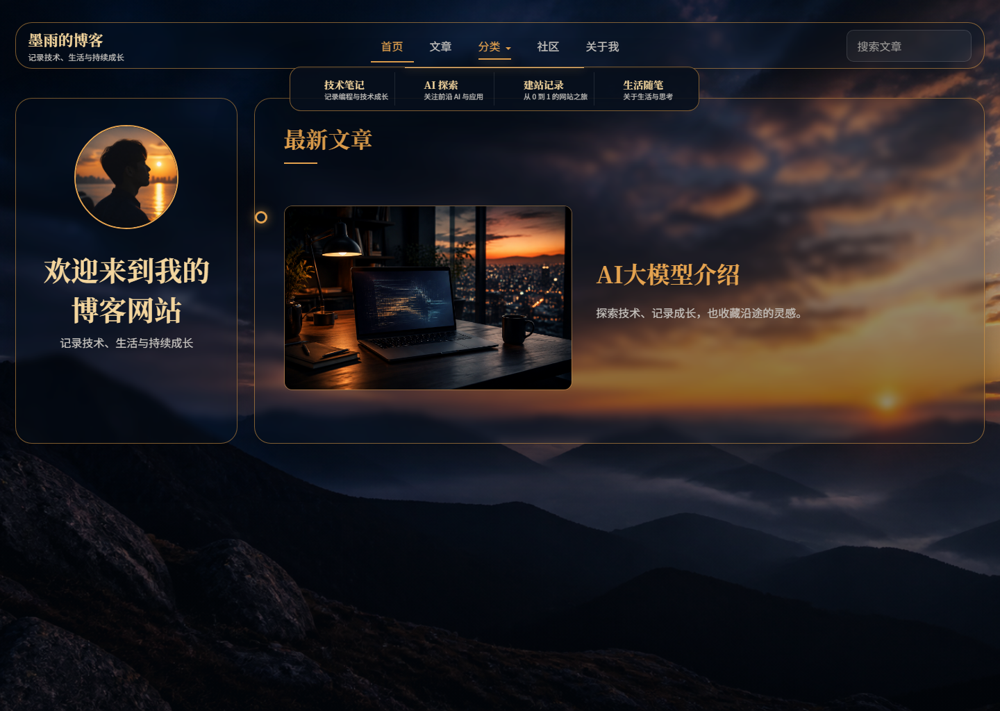

# 🌇 Moyu Glass

一款为个人博客设计的 WordPress 夕阳玻璃态主题。

在保留清晰阅读体验的基础上，Moyu Glass 使用 4K 晚霞背景、半透明玻璃卡片、双栏首页与文章时间线，适合记录技术、生活和持续成长。

[🌐 在线博客](https://www.moyu.loan/) · [📦 下载主题](https://github.com/MoYu-code-bot/Blog/archive/refs/heads/main.zip)



---

## ✨ 主题特性

### 🎨 视觉体验

- 夕阳晚霞全屏背景与深色沉浸式阅读界面
- 原生 CSS 玻璃态卡片、柔和阴影与金色强调色
- 桌面端鼠标流光跟随效果，自动尊重减少动态效果设置
- 桌面端双栏布局，移动端自动切换为单栏
- 顶部品牌、导航和文章搜索统一展示

### 📝 内容增强

- 首页仅展示最新 10 篇文章
- 独立文章归档页，支持分页浏览全部文章
- 按年份展示文章时间线
- 每篇文章支持独立特色图片
- 显示发布日期、最后更新时间、分类和预计阅读时间
- 正文支持标签、上一篇/下一篇导航
- 深色代码块与行内代码样式

### 💬 评论互动

- 使用 WordPress 原生评论系统
- 支持后台审核、回复与分页
- 可设置评论必须经管理员批准后公开显示

### 👤 个性化资料

- 可在 WordPress 自定义器中修改顶部名称
- 可编辑头像、个人名称、简介、技能标题和四项技能
- 支持填写个人网站与 GitHub 链接，GitHub 使用图标展示
- 支持手动添加多个个人标签，与文章标签同时展示
- 自动展示文章数量、全站浏览量、常用标签和最近更新
- 不采集访客 IP、位置、运营商或浏览器信息

---

## 🚀 安装主题

### 环境要求

- WordPress 6.0 或更高版本
- PHP 7.4 或更高版本

### 后台安装

1. 下载仓库 ZIP 文件并解压。
2. 将主题目录重新压缩为 `moyu-glass.zip`。
3. 登录 WordPress 后台，进入“外观 → 主题 → 安装主题 → 上传主题”。
4. 上传 ZIP，安装后先实时预览，再启用主题。

### WebFTP 安装

将整个主题目录上传至：

```text
/wwwroot/wp-content/themes/moyu-glass/
```

不要覆盖 `wp-admin`、`wp-includes` 或 WordPress 根目录文件。

---

## 📂 项目结构

```text
moyu-glass/
├── assets/images/              # 晚霞背景、头像和图片素材
├── template-parts/
│   ├── navigation.php          # 顶部导航与搜索
│   ├── sidebar.php             # 可编辑个人资料和动态侧栏
│   ├── post-timeline.php       # 文章时间线与卡片
│   └── footer.php              # 双行页脚
├── comments.php                # 评论列表与评论表单
├── front-page.php              # 首页最新 10 篇文章
├── home.php                    # WordPress 文章页入口
├── index.php                   # 文章归档与搜索结果
├── page.php                    # 普通页面和“关于我”
├── single.php                  # 文章正文
├── functions.php               # 主题功能与自定义器设置
├── style.css                   # 主题信息与响应式样式
└── screenshot.png              # WordPress 主题预览图
```

---

## ⚙️ 初始配置

### 设置主页和文章页

1. 在“页面”中创建并发布“首页”和“文章”两个页面。
2. 进入“设置 → 阅读”。
3. 将“您的主页显示”设为“一个静态页面”。
4. 主页选择“首页”，文章页选择“文章”，然后保存。

### 创建“关于我”

1. 新建标题为“关于我”的页面。
2. 将固定链接别名设为 `about`。
3. 使用 WordPress 页面编辑器填写个人信息并发布。

### 编辑左侧资料栏

进入“外观 → 自定义 → MY Blog 左侧栏”，可以编辑：

- 顶部名称
- 个人头像、名称和简介
- 技能标题和四项技能
- 站点统计、标签和最近更新的标题
- 多个个人标签，可使用逗号、中文逗号或换行分隔
- 个人网站与 GitHub 链接

### 编辑页脚

进入“外观 → 自定义 → MY Blog 页脚”，可以分别修改上方版权文字和下方页脚文案。

浏览量统计只累计普通前台页面访问，不统计后台、预览、订阅源以及管理员自己的访问。

### 设置文章图片

编辑文章，在右侧“特色图片”面板中选择图片。每篇文章可以使用不同图片；未设置特色图片时，文章卡片不会重复显示默认图片。

### 开启评论审核

1. 进入“设置 → 讨论”。
2. 勾选“允许他人在新文章上发表评论”。
3. 勾选“评论必须经人工批准”。
4. 评论提交后会进入“评论 → 待审”，批准后才会展示。

对于旧文章，可在文章编辑页的“讨论”面板中单独启用“允许评论”。

---

## 🖼️ 图片建议

- 背景图：建议使用 3840 × 2160 或更高分辨率的横向图片
- 文章特色图片：建议使用 16:9 横向图片
- 头像：建议使用 1:1 正方形图片，主题会自动裁剪为圆形
- 上传前适当压缩图片，以减少首页加载时间

---

## 🔧 开发说明

本项目是传统 WordPress PHP 主题，不需要 Node.js、npm 或构建步骤。修改 PHP、CSS 或图片后重新上传主题目录即可。

```bash
git clone https://github.com/MoYu-code-bot/Blog.git
```

主题样式版本位于 `style.css`，WordPress 会使用版本号刷新前端样式缓存。

---

## 🙏 致谢

部分内容功能与 README 组织方式参考了 [Fuwari Enhanced](https://github.com/Besty0728/fuwari)，Moyu Glass 保持独立的 WordPress 实现和现有夕阳玻璃态结构。

---

> Stay curious, keep learning, and grow a little every day.
